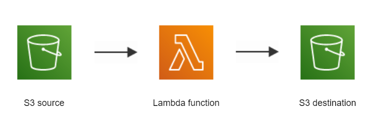

# Move Files between S3 folders

Use the boto3 ```copy_object()``` and ```delete_object()``` method to move files between S3 buckets.

<p>
    
</p>

## Folder Structure
```bash
├── Source bucket
    ├── Source folder
        ├── Source files

├── Destination bucket
    ├── Destination file
```
