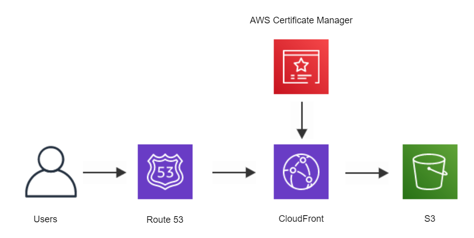
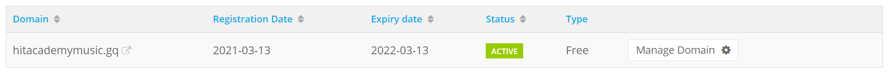
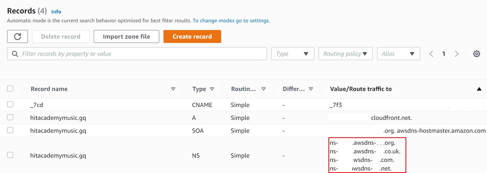

# How to host a static website on AWS

## Project Description

This project hosts a static website designed by [Tanaka Jera](https://www.linkedin.com/in/tjera/) on AWS using S3, Route 53, Certificate Manager and CloudFront. The contents of the website are stored in a public S3 bucket. When a user goes to our domain name Route 53 routes the user to CloudFront. CloudFront gets an https certificate from AWS Certificate Manager and serves the website from an S3 bucket to the user.

<p>
    
</p>

## Table of Contents

- [Prerequisits](#Prerequisits)
- [Step-by-Step Guide](#Step-by-Step-Guide)
- [Create an S3 Bucket](#Create-an-S3Create-an-S3-Bucket)
- [Static website hosting](#Static-website-hosting)
- [Create a Domain Name](#Create-a-Domain-Name)
- [Set up Route 53](#Set-up-Route-53)
- [AWS Certificate Manager](#AWS-Certificate-Manager)
- [CloudFront](#CloudFront)

## Prerequisits

- an AWS account
- frontend for a website

## Step-by-Step Guide

### Create an S3 Bucket

In the AWS Management Console, navigate to S3. Click on 'Create Bucket' and give it a unique name. Select a region and deselect 'Block all public access'. Once you have created your bucket, click on it and navigate to permissions. Add the following JSON to bucket policy and replace 'my-aws-bucket' with your bucket name:

```
{
    "Version": "2012-10-17",
    "Id": "Policy1569048588734",
    "Statement": [
        {
            "Sid": "Stmt1569048587703",
            "Effect": "Allow",
            "Principal": "*",
            "Action": "s3:GetObject",
            "Resource": "arn:aws:s3:::my-aws-bucket/*"
        }
    ]
}
```

This allows read access to your bucket. In your S3 dashboard, you should now be able to see a 'Public' bucket.

<p>
    
</p>

Upload your website content to the S3 bucket.

### Static website hosting

In your S3 bucket, navigate to properties, scroll down to 'Static website hosting' and enable it. This will also give you the opportunity to define an index page for your website. To see the website, click on the Bucket website endpoint which will open your website in a new tab.

However, the URL is neither user-friendly nor secure. We will not continue to create a custom URL that uses the HTTPS protocol.

### Create a Domain Name

There are a multitude of domain registrars, but for this tutorial we will use [Freenom](https://www.freenom.com/en/index.html?lang=en). Navigate to the website and check if your desired domain name is available. Domains such as .tk, .ml etc are free, but also less popular with search engines. Once you have decided which domain to use (eg my-aws-domain.tk), click on checkout and create an account to register your domain.

You can then find it under Services -> My Domains.

### Set up Route 53

Navigate to Route 53 and click on 'Create Hosted zone'. A hosted zone is a container for records which contain information on how you want to route traffic to your domain.

Copy the domain name that you just created in Freenom (my-aws-domain.tk) and paste it into the domain name field. Leave the type as puvlic hosted zone and click on create.

Now go back to Freenom and click on 'Manage Domain' next to your domain name. Next, click on Management Tools -> Nameservers

<p>
    
</p>

Copy and paste all 4 values under the 'Value/Route traffic to' from your Route 53 NS record into your nameservers on Freenom and confirm with 'Change Namservers.

<p>
    
</p>

### AWS Certificate Manager

In AWS, navigate to Certificate Manager. Request a public certificate and enter your domain name (my-aws-domain.tk). Select DNS validation and request your certificate. While the validation is pending, expand the Domain section under Status and click on the 'Create Record in Route 53' button.

<p>
    
</p>

### CloudFront

CloudFront is a content delivery network that delivers your website to the user from an edge location that's closest to the user. Click on 'Distribution' and select the web version.

Fill in the Origin Domain Name with the endpoint from the S3 bucket static website without http:// (eg my-aws-domain.s3-website.eu-central-1.amazonaws.com). Under 'Default Cache Behavior Settings' select 'Redirect HTTP to HTTPS'. Under 'Distribution Settings' fill in the 'Alternative Domain Names' with your Freenom domain name (my-aws-domain.tk). Select 'Custom SSL Certificate' and select the certificate you created in the previous step. Now, create the distribution. Once your distribution has been deployed, you can visit your website using the Freenom domain name.
