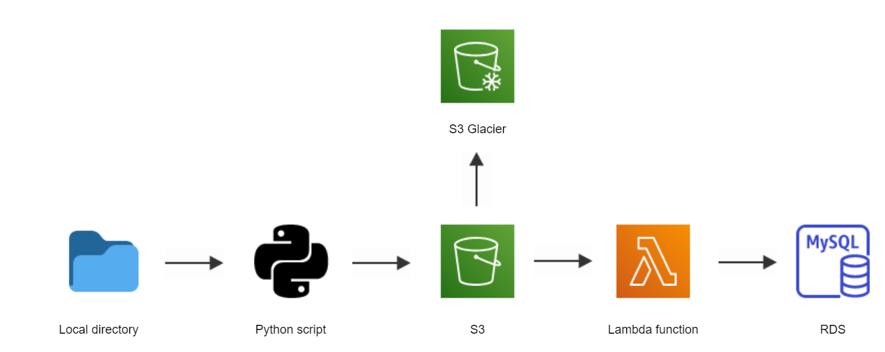
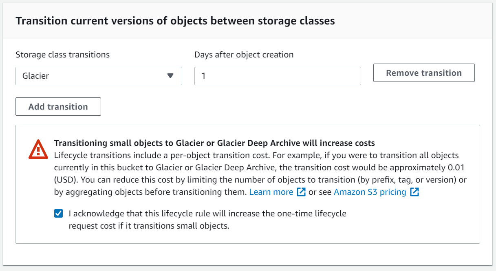
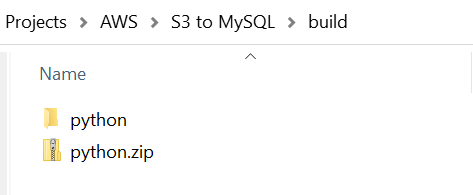

# Import csv files from S3 to MySQL RDS with Lambdas

## Description

This tutorial describes how to push csv files from a local directory to S3 and how to ingest them into a MySQL RDS on AWS. The pipeline is powered by a Lambda function which is triggered as soon as a file is dropped into the S3 bucket. Once the file has been ingested, it is moved into Glacier.

<p>
    
</p>


## Table of Contents

- [Prerequisits](#Prerequisits)
- [Step-by-Step Guide](#Step-by-Step-Guide)
- [Create an S3 Bucket](#Create-an-S3-Bucket)
- [Create a Lifecycle rule](#Create-a-Lifecycle-rule)
- [Write a script to push data to S3](#Write-a-script-to-push-data-to-S3)
- [Create a MySQL instance](#Create-a-MySQL-instance)
- [Connect to the MySQL instance with MySQL Workbench](#Connect-to-the-MySQl-instance-with-MySQL-Workbench)
- [Create a Lambda role](#Create-a-Lambda-role)
- [Create a Lambda function](#Create-a-Lambda-function)
- [Add a Lambda Layer](#Add-a-Lambda-Layer)
- [Write the Lambda function](#Write-the-Lambda-function)
- [Execute the script](#Execute-the-script)

## Prerequisits

- an AWS account
- MySQL Workbench installed (https://www.mysql.com/products/workbench/)

## Step-by-Step Guide

### Create an S3 Bucket

In the AWS Management Console, navigate to S3. Click on 'Create Bucket' and give it a unique name. Select a region and leave all default settings.

Once the bucket has been created, click on it and select 'Create Folder' and give it a name, eg 'csvdata'.

<p>
    
</p>

### Create a Lifecycle rule

Navigate to your S3 bucket and click on the 'Management' tab. You can now create a lifecycle rule to move the csv files from the standard S3 storage into an archive. Click on 'Create lifecycle rule' and assign it a name. Enter 'csvdata/' as prefix so the rule is only applied to this specific folder. In the 'Lifecycle rule actions' section, select 'Transition current versions of objects between storage classes' and pick a storage class. We are going to move everything to Glacier after 1 day. Acknowledge the ocst warning and create the rule.

<p>
    
</p>

### Write a script to push data to S3

We are going to write a Python script that pushes all files in a local directory to S3.

First, you will need your access key and secret access key from the IAM console. You can find the access key under Users -> User Name -> Security Credentials. If you can't remember your secret access key, you can generate a new one by creating a new access key. It will only be visible when creating the key, so remember to store it as environment variable.

[This script](https://github.com/lb930/AWS/blob/main/S3%20to%20MySQL%20RDS/import_to_s3.py) will allow you to push data to S3.

### Create a MySQL instance

Search for RDS in the AWS Management Console. Navigate to 'Database' in the left-hand panel and click on 'Create database'. Select 'Easy Create' and MySQL. This will come with predetermined seetings. It also means that the database won't be accessible publicly, which we will change later on. Make sure you create it in the same region as your S3 bucket. 

<p>
    
</p>

Give it a name (the default value is database-1), pick a username and a password. You will need this information later. Click on 'Create Database'. It will now take a few minutes before the instance goes live.

In the database overview, select your database and hit 'Modify'. Scroll down to 'Connectivity' and 'Additional configuration' and set it to 'Publicly accessible. Confirm your changes.

<p>
    
</p>

In order to connect to your database instance with MySQL workbench, you need to allow all incoming connections. In order to do so, go to your database, scroll down to 'Security Group Rules' and click on the security group if it has been configured. In the security group page, you will see an 'Inbound rules' tab. Select it and click on 'Edit inbound rules'. Change the source to 'Anywhere'.

<p>
    
</p>

<p>
    
</p>

### Connect to the MySQL instance with MySQL Workbench

Now it's time to connect to your database instance with MySQL workbench so you can run queries. Open MySQL Workbench and click on the + symbol next to MySQL Connections. Pick a connection name and fill in the hostname with the endpoint of your AWS MySQL instance. Username is the one you used when you created the instance on AWS (the default is admin). You can find your username in the 'Configuration' tab of your database on AWS. Once you hit OK, you will be prompted for the password you chose on AWS.

<p>
    
</p>

Once you’re connected, open a SQL editor and type:

```
CREATE DATABASE aws_test
```

followed by:

```
USE aws_test
```

Then create a table with a schema that fits your csv file:

```
CREATE TABLE test (
    text_col VARCHAR(40),
    number_col INT,
    date_col DATE
)
```

### Create a Lambda role

In order for your Lambda function to access S3, Cloudwatch (for log files) and the RDS, you need to assign it a role with the relevant permissions. In the AWS management Console, search for IAM. Click on 'Roles' in the left-hand panel and select 'Create Role'. Select use case Lambda and go to Permissions. Select 'AmazonS3FullAccess', 'CloudWatchFullAccess' and 'AmazonRDSFullAccess'. Assign a name to your role and confirm.

<p>
    
</p>

### Create a Lambda function

Select Lambda from the AWS Management Console. Go to 'Create function' and select 'Author from scratch'. Name the function and select Python 3.8 from Runtime. In the 'Permissions' section, select the role you created in the previous step.

Next, we want to create a trigger that executes the Lambda function. Go to your function and click on 'Create Trigger. In the trigger section, choose S3. Select the bucket you created for this project and choose 'All objects create events' as  event type. In the prefix section, select the folder csvdata/ and in the suffix section, type .csv. Acknowledge the recursive invocation statement at the bottom and add the trigger.

<p>
    
</p>

### Add a Lambda Layer

We want to use the MySQL Python module within our Lambda function. This isn't supported natively by AWS so we need to create a layer that contains this module. A layer is a zip archive that contains libraries, a custom runtime or other dependencies.

When a layer zip archive is loaded into AWS Lambda, it is unzipped to ```build/python/lib/python3.8/site-packages```. In your project folder on your local machine, replicate this folder structure.

```mkdir -p build/python/lib/python3.8/site-packages```

Install mysql-connector into this newly created directory:

```pip install mysql-connector -t build/python/lib/python3.8/site-packages```

Now navigate to build/ and create a zip file from the python/ folder.

<p>
    
</p>

Go back to your Lambda function and click on Layers in the left pane. Create a layer and add the zip file you just created. Select Python 3.8 as Runtime.

Go back to your Lambda function, click on Layers, scroll down and click 'Add a layer'. Select 'Custom layer' and use the one you have just created. 

### Write the Lambda function

Now it's finally time to write the actual lambda function that will do the heavy lifting for us. Go to your Lambda function and scroll down to Function Code. Right-click on lambda_function.py and hit 'Open'. 

<p>
    
</p>

Insert [this code snippet](https://github.com/lb930/AWS/blob/main/S3%20to%20MySQL%20RDS/s3_to_mysql.py) into the function. Remember to replace the values for host, database, user and password in lines 27 - 30. Depending on your csv file, you may also want to adjust row 33 with your column names.

Once that's done, deploy your code.

### Execute the script

In the command line, navigate to your folder containing the files you'd like to upload and execute the script that pushes data to S3 ([this one](https://github.com/lb930/AWS/blob/main/S3%20to%20MySQL%20RDS/import_to_s3.py)). Head over to Cloudwatch -> Log Groups and click on the log group with our Lambda function name. If everything worked, you should see that 3 rows were successfully inserted into the database. You can now check those rows in MySQL Workbench.

<p>
    
</p>
